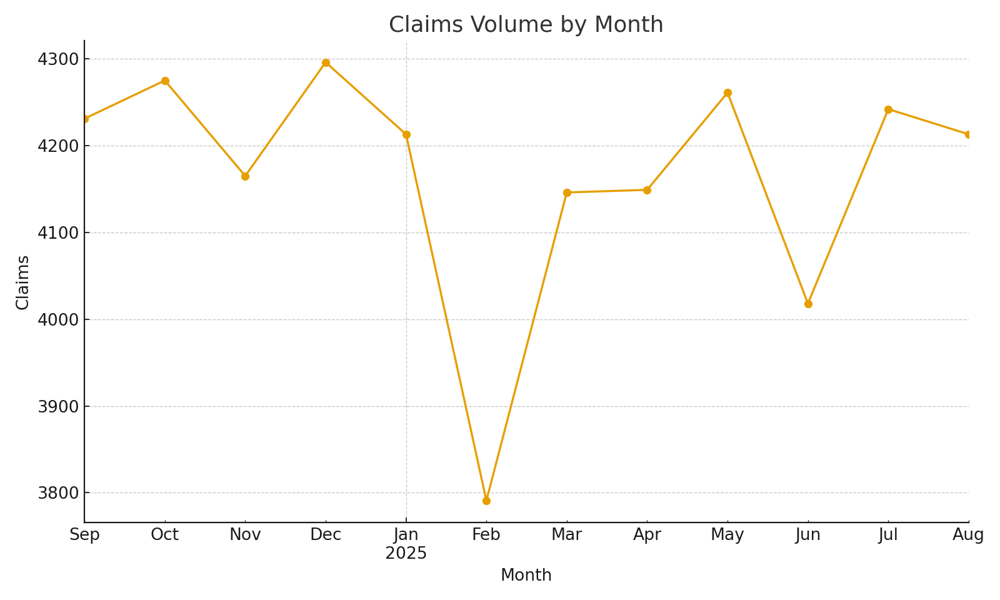
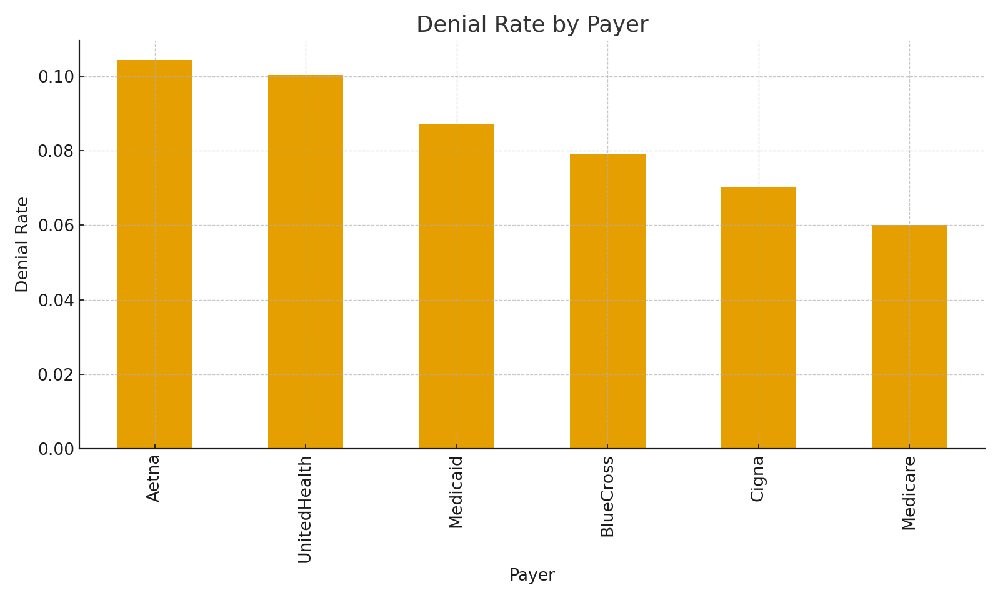
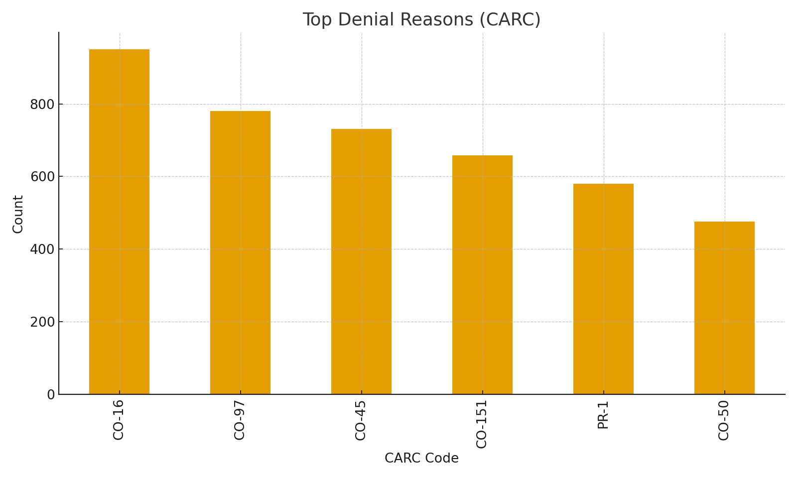
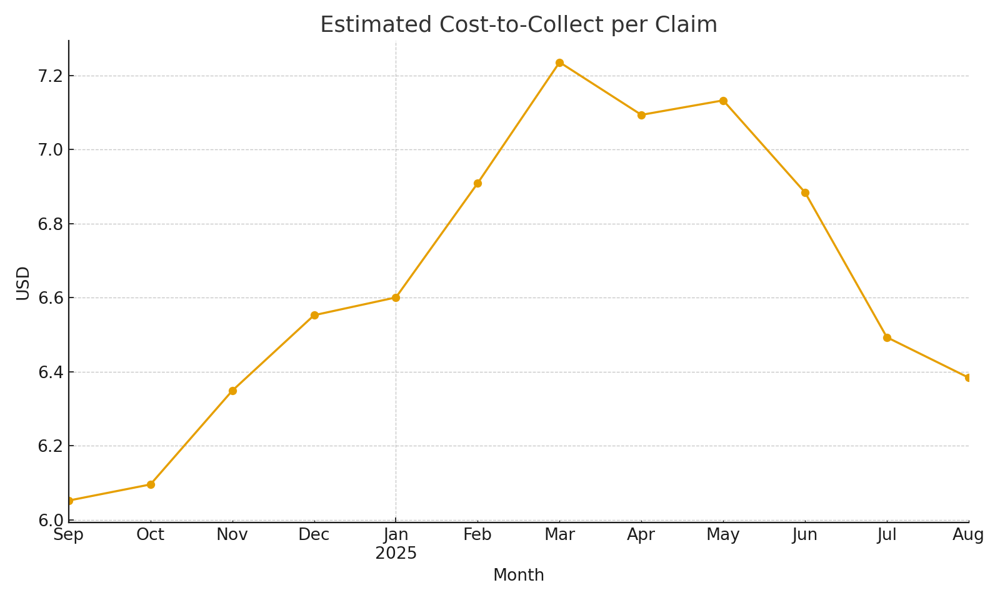

# 🚀 QMTRY Launch Dashboard: Revolutionize Claims Processing to Slash Denials and Boost Revenue

Imagine transforming your claims pipeline into a high-efficiency machine that cuts denial rates by up to 5-10%, shrinks days-to-pay from weeks to days, and drives down cost-to-collect—unlocking millions in trapped revenue for UnitedHealth Group. As a leader in healthcare innovation, you're no stranger to the $265 billion annual waste from administrative inefficiencies and denials in the U.S. system. QMTRY's automated dashboard proves it: using synthetic, HIPAA-safe data, we deliver actionable insights that empower proactive appeals, front-end edits, and payer negotiations. Ready for a demo? Swap in your real feeds tomorrow and watch the ROI soar.

This **dark-theme Streamlit app** automates revenue cycle analytics, turning raw claims data into denial-busting intelligence. Built for speed: launch in minutes with demo data, then integrate your Synthea CSVs or live EDI feeds (837/835/999/277CA). Proven to reduce denials, accelerate payments, and minimize overhead—perfect for scaling across UnitedHealth's vast network of providers and payers.

<p align="center">
  
  
  <br/>
  
  
</p>

## 💡 The ROI Story: Unlock $100M+ in Value for UnitedHealth Group
In a $4 trillion industry, every percentage point matters. For UnitedHealth, with billions in annual claims volume, a 1% denial reduction on just $10M billed monthly could reclaim $100K–$150K in revenue—scaling to $100M+ enterprise-wide based on appeal yields and mix. QMTRY queues top denial drivers like CO-16/CO-97, enables front-end fixes in coding and edits, and delivers before/after trend lines to quantify impact.

- **Cut Denials**: Identify payer-specific patterns and automate appeals for faster resolutions.
- **Shrink Days-to-Pay**: Average DTP drops as insights streamline workflows.
- **Reduce Cost-to-Collect**: Trend tracking reveals efficiencies, lowering operational drag.
- **Compliance-Ready**: Synthetic data for demos; supports de-identified datasets in production.

Partner with QMTRY to pilot this in one division—see measurable wins in weeks, then roll out network-wide. Let's discuss how this aligns with UnitedHealth's mission to simplify healthcare and drive value-based care.

## 🏁 One-Path Quickstart
Get up and running in under 5 minutes. The dashboard loads synthetic demo data (`data/sample/claims_demo.csv`) and renders interactive charts. Use the left sidebar for payer and date filters.

### Windows PowerShell
```powershell
python -m venv .venv
.\.venv\Scripts\Activate.ps1
pip install -r requirements.txt
streamlit run app/streamlit_app.py
```

### macOS / Linux
```bash
python3 -m venv .venv
source .venv/bin/activate
pip install -r requirements.txt
streamlit run app/streamlit_app.py
```

## 🔁 Integrate Your Data: From Demo to Production
Start with Synthea for testing, then swap in real feeds for live insights.

If your Synthea CSVs are in `Y:\Synthea\csv` (Windows example):
```powershell
python scripts/build_claims_from_synthea.py --input "Y:\Synthea\csv" --out data\claims_canonical
```

Update the app's data path to `data/claims_canonical/claims_demo.csv`.

In production:
- Replace the Synthea generator with your ETL from clearinghouses (837/835/999/277CA).
- Maintain the canonical tables below—the dashboard adapts seamlessly.

## 🧱 Canonical Data Model
Simple, scalable schema for robust analytics.

### Tables
- **claims_header**: claim_id, member_id, provider_id, payer, service_date, billed_amount, allowed_amount, paid_amount, status
- **claims_line**: claim_id, line_number, hcpcs, billed_amount

### Suggested Marts (via dbt)
- **payer_month**: month, payer, claims, denials, denial_rate, dtp_avg, paid, billed, allowed
- **provider_denials**: provider_id, payer, carc_code, count, billed, allowed

## 🧮 Key KPIs & Features
Drive decisions with at-a-glance metrics and tools.

### KPIs
- Total Claims • Denial Rate • Paid • Allowed • Billed
- Days-to-Pay (average) • Estimated Cost-to-Collect (trend)

### Dashboard Features
- Dark theme, responsive layout (powered by Plotly + Streamlit)
- Interactive filters: Payers and date ranges
- Denial rate by payer (sortable bar charts)
- Top CARC denial reasons
- **Outreach Queue Export (CSV)**: claim_id, member_id, provider_id, payer, service_date, billed, allowed, denial_reason—ready for appeals teams

## 🧭 Architecture Overview
Scalable from local dev to enterprise deployment.

```
Inbound feeds (Synthea CSV or EDI 837/835)
        │
        ▼
Python ETL → Canonical tables (claims_header, claims_line)
        │
        ├─ dbt transforms → marts (payer_month, provider_denials)
        │
        ├─ Great Expectations checks → evidence JSON/CSV + run metadata
        │
        ▼
Streamlit dashboard (behind SSO) → Outreach Queue export (CSV)
```

Secure it with a gateway/identity proxy (e.g., Okta or Azure AD) for SSO integration—aligned with UnitedHealth's enterprise standards.

## 📦 Repo Layout
```
app/
  streamlit_app.py
assets/
  claims_volume.png
  denial_rate_by_payer.png
  top_denials.png
  cost_to_collect_trend.png
data/
  sample/claims_demo.csv
scripts/
  build_claims_from_synthea.py
requirements.txt
README.md
```

## 🔒 Evidence & Compliance Hooks
Built for regulated environments like UnitedHealth's.

- **dbt**: Tests (unique, not-null, accepted-values), docs, lineage graphs.
- **Great Expectations**: Schema + range checks (date windows, payer lists, ratios like allowed ≤ billed).
- **Evidence Bundle**: Emit CSV/JSON artifacts per run (inputs, outputs, validation results, metrics).
- **Disclaimers**: Demo uses synthetic data (no PHI); production supports de-identified/limited datasets.

## 🔧 Configuration Notes
- Runs locally by default (DuckDB-compatible for quick spins).
- Scale to Postgres/Redshift/Snowflake via dbt profiles.
- Manage secrets with dotenv, CI/CD, or Streamlit Cloud.
- For production: Containerize (Docker), deploy behind SSO, and log run IDs/validation artifacts.

## 📝 License & Contact
- **License**: MIT (adjust as needed for enterprise partnerships).

QMTRY, LLC: Your Federal Health IT subcontractor and PMO partner, specializing in revenue cycle optimization for giants like UnitedHealth Group. Let's schedule that demo—email contracts@qmtry.com today to explore a tailored pilot.
